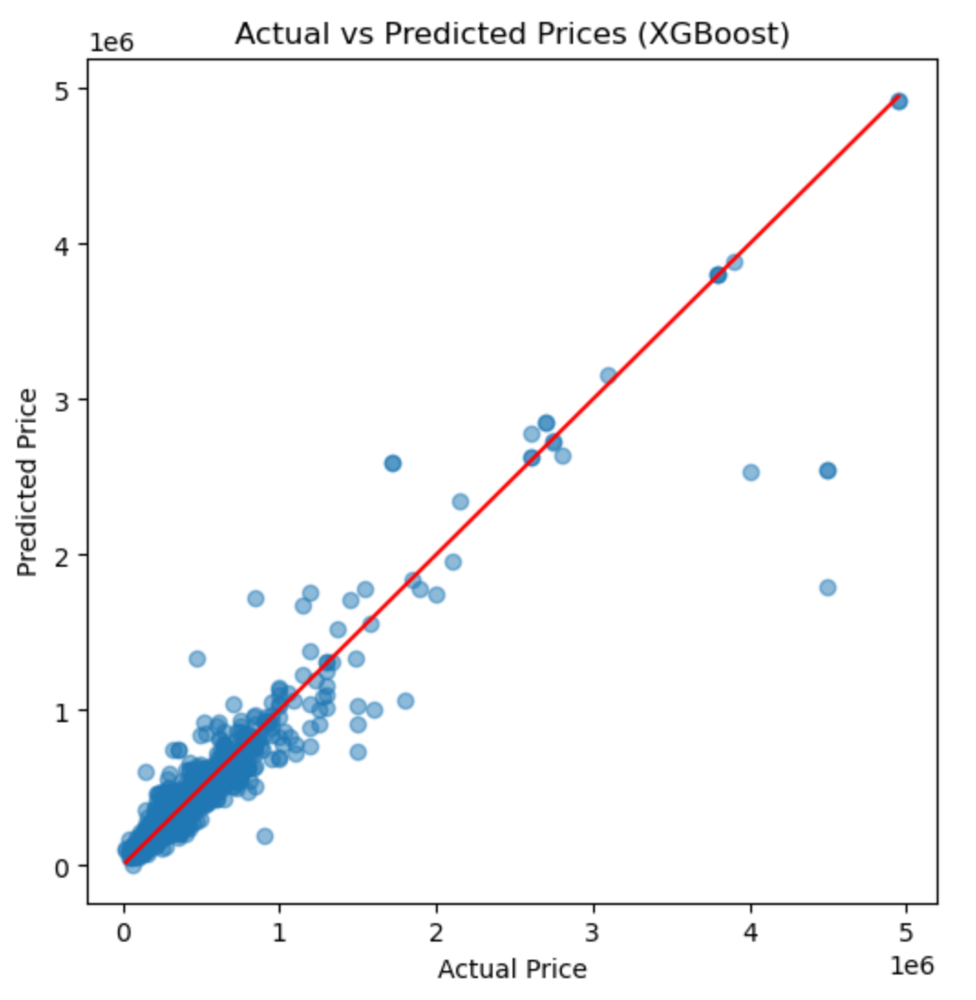

# Used Car Price Prediction

Machine learning project for predicting the selling price of used cars using multiple regression models and evaluating their performance using standard regression metrics.

---

## Project Preview

---

## Project Overview

The goal of this project is to build a machine learning model that can accurately predict the selling price of used cars based on features such as car brand, model, year, fuel type, transmission type, kilometers driven, and ownership history.

The project demonstrates a complete machine learning workflow including data exploration, preprocessing, model training, evaluation, and error analysis.

---

## Dataset

The dataset contains information about used cars including:

- Car brand
- Car model
- Year of manufacture
- Fuel type
- Transmission type
- Kilometers driven
- Ownership history
- Selling price (target variable)

---

## Machine Learning Workflow

The project follows a structured machine learning pipeline:

1. **Data Exploration**
   - Dataset inspection
   - Statistical summary
   - Distribution analysis

2. **Feature Engineering**
   - Extracting brand and model from the car name column

3. **Data Preprocessing**
   - One-hot encoding for categorical features
   - Standard scaling for numerical features
   - ColumnTransformer for applying transformations to specific columns

4. **Model Training**
   - Multiple regression models were trained and compared

5. **Model Evaluation**
   - Performance comparison using multiple metrics

6. **Error Analysis**
   - Actual vs predicted price plot
   - Residual analysis to examine prediction errors

---

## Models Used

The following regression models were implemented and evaluated:

- Linear Regression
- Decision Tree Regressor
- Random Forest Regressor
- Gradient Boosting Regressor
- XGBoost Regressor

---

## Evaluation Metrics

Model performance was evaluated using the following metrics:

- **R² Score**
- **Mean Absolute Error (MAE)**
- **Root Mean Squared Error (RMSE)**

Residual analysis was also performed to examine prediction errors:

Residual = y_{actual} - y_{predicted}

A good regression model should produce residuals randomly distributed around zero, indicating the absence of systematic bias.

---

## Results

After comparing all models, **XGBoost Regressor achieved the best performance** on the test dataset, providing the highest predictive accuracy and lowest error metrics.

Ensemble tree-based models generally performed better than simple linear models for this structured tabular dataset.

---

## Visualizations

The notebook includes several visualizations to analyze the data and model performance:

- Distribution of car selling prices
- Model performance comparison plots
- Train vs test performance comparison
- Actual vs predicted price scatter plot
- Residual analysis plot

These visualizations help better understand model behavior and prediction errors.

---

## Technologies Used

- Python
- pandas
- matplotlib
- seaborn
- scikit-learn
- XGBoost
- Jupyter Notebook

---

## How to Run the Project

1. Clone the repository
2. Install required libraries
3. Open the notebook

## Future Imporvements
Possible improvements to this project include:
1. Hyperparameter tuning of the models
2. Handling high-cardinality categorical features more effectively
3. Additional feature engineering
4. Testing additional regression algorithms

Author: 
Deepanshu Sati
